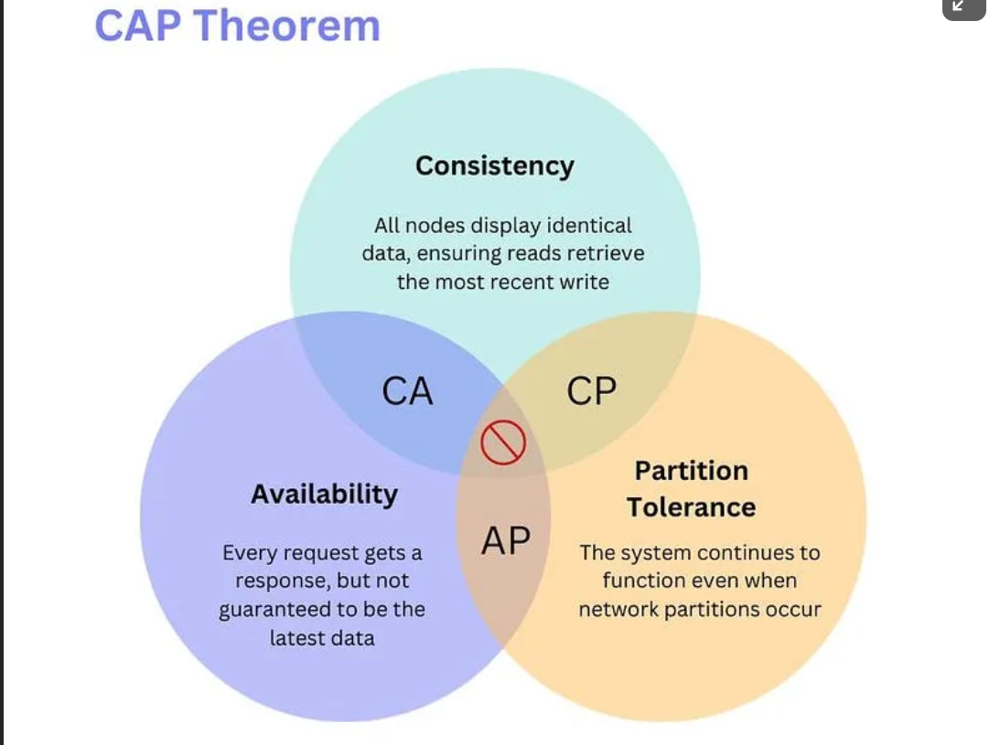

# Mongo DB
## CAP Theorem


## Types de valeur des propriétés mongo

- int
- number (float | double)
- string
- date
- binary

- array (ensemble de valeurs)
- object (ensemble de propiétés => clé : valeur)

ex: 
personne:
	nom (string)
	prenom (string)
	dateNaissance (date)
	compétences (Array)
	adresse (object)
		rue (string)
		numero (int)
		ville (string)

```json
{
	"nom": "LY",
	"prenom": "Khun",
	"dateN": new Date('1982-05-06'),
	"competences": ["c#", "mongo", "sql"],
	"adresse": {
		"rue": "Rue ...",
		"numero": 42,
		"ville": {
			"cp": 5000,
			"nom": "Namur"
		}
	},
	"voitures": [
		{ "nom": "Audi", "immatriculation": "2BPX894" },
	]
}
```

BSON => JSON Binaire

JSON => JavaScript Object Notation

object en js => {}

array en js => []

Un document (toujours de type object) : enregistrement d'une donnée <=> ligne en SQL

Une collection : ensemble de documents
<=> table en SQL


